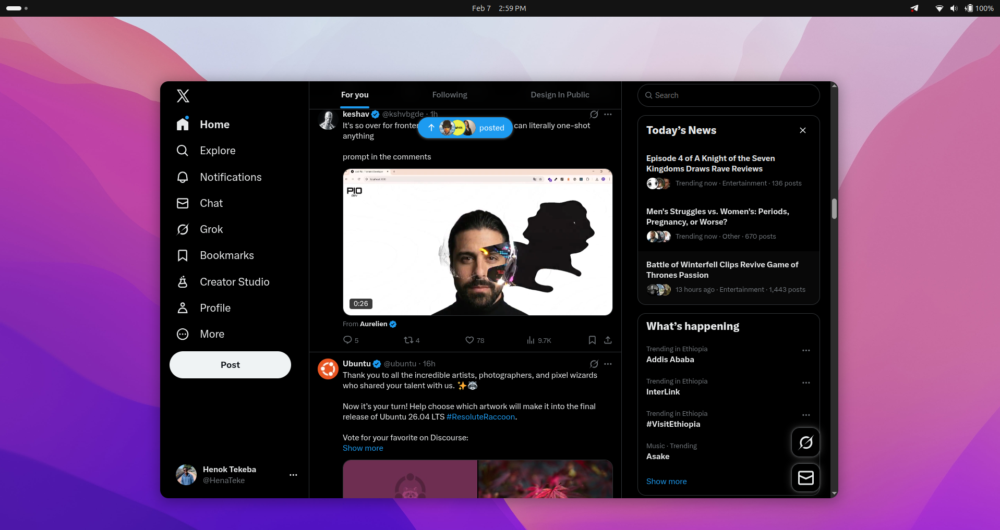

# X Electron Wrapper

<p align="center">
  
</p>

<p align="center">
  A clean, minimal Electron wrapper for X (Twitter) with native desktop integration on Linux.
</p>

<p align="center">
  
  
  
</p>

## Features

- Native Desktop Experience - Run X as a standalone application
- Rounded Corners - Beautiful rounded window corners on GNOME
- Custom Icon - Proper app icon that matches your system theme
- Lightweight - Minimal overhead, just the essentials
- Secure - Runs X in an isolated Electron container

## Screenshots

<p align="center">
  
</p>

## Quick Start

### Prerequisites

- Node.js 16 or higher
- npm or yarn
- GNOME Desktop (for rounded corners feature)

### Installation

1. Clone the repository
```bash
   git clone https://github.com/Henok-Tekeba/X-electron_wrapper.git
   cd X-electron_wrapper
```

2. Install dependencies
```bash
   npm install
```

3. Run in development mode
```bash
   npm start
```

## Building

### Build the application
```bash
npm run make
```

This will create distributable packages in the `out/make` directory.

### Install the .deb package
```bash
sudo dpkg -i out/make/deb/x64/*.deb
```

After installation, you can launch the app from your application menu.

### Uninstall
```bash
sudo dpkg -r x-electron-wrapper
```

## Enable Rounded Corners (GNOME)

For the beautiful rounded corners effect, you need to install the Rounded Window Corners GNOME extension.

### Method 1: Using Extension Manager (Recommended)

1. Install Extension Manager
```bash
   sudo apt install gnome-shell-extension-manager
```

2. Open Extension Manager from your applications

3. Search for "Rounded Window Corners"

4. Click Install and enable the extension

5. Configure the extension to apply rounded corners to all windows or specific applications

### Method 2: Manual Installation

1. Clone the extension repository
```bash
   git clone https://github.com/yilozt/rounded-window-corners.git
   cd rounded-window-corners
```

2. Install the extension
```bash
   make install
```

3. Enable the extension
```bash
   gnome-extensions enable rounded-window-corners@yilozt
```

4. Restart GNOME Shell
   - Press `Alt + F2`
   - Type `r` and press Enter
   - Or log out and log back in

### Verify Installation

After installing the extension, restart your X Electron Wrapper app. You should now see beautiful rounded corners.

## Development

### Project Structure
```
X-electron_wrapper/
├── build/
│   └── icon.png          # Application icon
├── src/
│   ├── main.js           # Main process
│   ├── renderer.js       # Renderer process
│   ├── preload.js        # Preload script
│   └── index.html        # HTML template
├── forge.config.js       # Electron Forge configuration
└── package.json          # Project dependencies
```

### Available Scripts

- `npm start` - Start the app in development mode
- `npm run package` - Package the app
- `npm run make` - Create distributable packages

## Troubleshooting

### App doesn't start
- Make sure all dependencies are installed: `npm install`
- Check Node.js version: `node --version` (should be 16+)

### Icon not showing
- Verify `build/icon.png` exists
- Rebuild the app: `npm run make`
- Reinstall the .deb package

### Rounded corners not working
- Ensure the GNOME extension is installed and enabled
- Check if you're using GNOME desktop: `echo $XDG_CURRENT_DESKTOP`
- Restart GNOME Shell: `Alt + F2`, type `r`, press Enter

### "Another compositor is already running" error
- You're already using a compositor (GNOME/KDE)
- Use the GNOME extension method instead of Picom

## License

MIT License - feel free to use this project however you'd like.

## Contributing

Contributions, issues, and feature requests are welcome.

1. Fork the repository
2. Create your feature branch (`git checkout -b feature/amazing-feature`)
3. Commit your changes (`git commit -m 'Add some amazing feature'`)
4. Push to the branch (`git push origin feature/amazing-feature`)
5. Open a Pull Request

## Show your support

Give a star if this project helped you.

## Contact

Henok Tekeba - [@Henok-Tekeba](https://github.com/Henok-Tekeba)

Project Link: [https://github.com/Henok-Tekeba/X-electron_wrapper](https://github.com/Henok-Tekeba/X-electron_wrapper)

---

<p align="center">Made with care for the Linux community</p>
